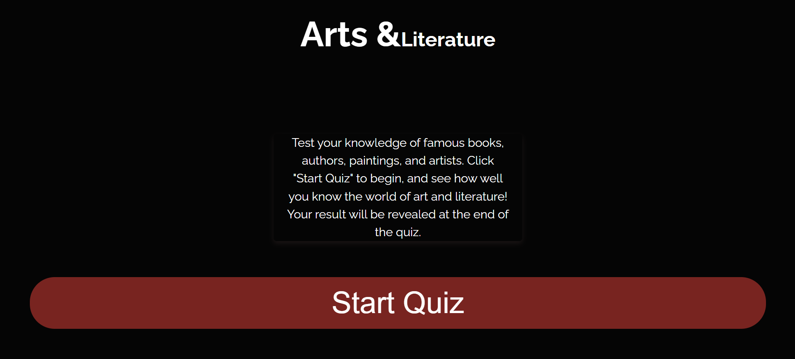

# Arts & Literature Quiz

## 
This is an An interactive Art & Literature Quiz that challenges players on their knowledge of famous literary works, authors, artists, and iconic artworks. Created with HTML, CSS, and JavaScript, this quiz offers a smooth, engaging experience as users navigate through questions, and see personalized results based on their performance at the end of the quiz.
Am I Responsive ![Webpage] https://ui.dev/amiresponsive?url=https://mildred-prog.github.io/quiz-time/index.html

## The Rules!

My game is simple.

**1.** 10 Questions, select `Start Quiz` when you are ready to start.

**2.** One guess per round.

**3.** Click `Next Question` when you are ready to move on.

**4.** See how bad or knowledgeable you are at the end of the quiz.

## User Goals

#### First time Visitors Goals: 
- As a user, I want to be able to start a quiz easily so that I can test my knowledge on art and literature right away.
- As a user, I want randomized questions each time I play, so the quiz feels fresh and engaging.
- As a user, I want to see my score and an encouragement message at the end to understand how well I did.
- As a user, I want the option to restart the quiz after viewing my score, so I can play again without refreshing the page.
- As a user, I want a visually appealing and simple design so that I can focus on the quiz without distraction.

#### Returning Visitor Goals: 
- As a returning user, I want to expand my Knowledge on art and literature.
- As a returning user, I want to access a list of questions I've previously answered incorrectly, so I can focus on improving in those areas.
- As a returning user, I want to achieve a higher score than before competing for the best score possible.

## Features 
- The Welcome container displays the Arts and literature header that is also a link to the home page,a welcome message giving an insight of what the user should expect and what the game is all about aswell as a start quiz button.
 

- The Game container, displays the actual quiz elements that the user will interact with,the rounds/ number of questions the user is on.

- The Results container displays the users final results of their game and a restart button

#### Future Features
- Implement a timer for each question to add a sense of urgency.
- Add the input for a username on the home page, to make user more engaged and feel more connected to the quiz.
- Incorporate sound effects for correct and incorrect answers.
- Add a leaderboard to the results page to give the game a competitive nature allowing users to battle against each other.

### Design:

#### Color Scheme:
- #050505 (Almost black)
Used for the primary background to create a sleek and immersive quiz experience, allowing text and interactive elements to stand out.
- #FFFFFF (White) White text is used against the dark background to ensure readability and maintain high contrast, especially for question text and main headers.
- #e63010 (Red-Orange)Applied to the "Next" button and restart button borders, adding vibrancy and visual focus to interactive elements.
- #782420 (Dark Brick Red)Used for button hover effects and restart button background, providing a warm, engaging highlight without overpowering the text.

#### Typography
- Font: Raleway (sans-serif)
The clean and modern Raleway font was selected to enhance readability and create a professional, stylish appearance. The font is applied to all main text, headings, and button labels.

#### Layout
- The app’s layout is responsive, designed to adjust to various screen sizes:

- Desktop: Buttons and text are displayed with larger padding and font sizes for easy navigation.
- Tablet and Mobile: Adjustments are made to reduce text and button sizes slightly, ensuring a compact, user-friendly interface

#### Wireframe
 A wireframe was created to plan the layout and structure of the website for mobile apps and desktop apps before development
 
 
 

#### Technologies:
Languages:                                           
- HTML5: Used for the structure of the website.       
- CSS3: Used for styling and making the website responsive across different devices.
- JavaScript: Used for game logic, question management, and user interaction.

Tools & Libraries:   
Google Fonts: For typography.                       
Git: For version control.                   
GitHub Pages: For hosting the live website.

### Testing

#### Validator Testing:                                   
HTML: Passed validation with the W3C HTML Validator.                                         
 
 https://validator.w3.org/nu/#textarea     
CSS: Passed validation with the W3C CSS Validator.
 
https://jigsaw.w3.org/css-validator/validator 
JAVASCRIPT: Passed validation with the Jshint.

https://jshint.com/

#### Browser Compactibility
Testing was completed in Google Chrome, Microsoft Edge and Firefox web browsers.

- Google Chrome

- Microsoft edge

- Firefox

#### Accessibility
The website was tested using light house to ensure accessibility ,it achieved a good score for Accessibility, Best practises and SEO

#### Links Testing
All internal and external links were tested to ensure they direct to the correct page and open in new tabs.

#### Clone 
To run website locally,
- Clone the repository

- Navigate to the project directory.
- Open index.html in your browser to view the website locally.

#### Deployment
The site was deployed to GitHub pages.
 The steps to deploy are as follows:      
- In the GitHub repository, navigate to the Settings tab     
- From the source section drop-down menu, select the Master Branch      
Once the master branch has been selected, the page will be automatically refreshed with a detailed ribbon display to indicate the successful deployment.              
The live link can be found here - https://mildred-prog.github.io/quiz-time/index.html

### Bugs

|    Bug   |   Fix   |
| ------------- | ------------- |
| Questions were not shuffling correctly on each quiz start.  | Implemented a shuffleQuestions() function to randomize the question array, ensuring questions appear in a different order each time. |
| The 'Next' button wasn't enabled after selecting an answer. | Created a nextBtnEnable() function to enable the button, allowing users to proceed to the next question. |
| Final score displayed incorrectly due to miscalculated correct answers.  | Adjusted the checkAnswer() function to track correct answers accurately.  |
| The welcome container lacked a heading, hence causing a warning in the w3c validator.  | Used div element to target the id.  |
| Goggle font was not imported correctly | Used the @import on the web to correct this rather than the link. |

  - [Development](#development)
    - [GitHub](#github)
    - [VSCode](#vscode)
      - [Cloning](#cloning)
      - [Extensions](#extensions)
      - [Editing](#editing)
  - [Deployment](#deployment)
    - [Github Pages](#github-pages)
    - [Forking](#forking)
  - [Credits](#credits)
    - [Content](#content)
    - [Media](#media)
    - [Acknowledgements](#acknowledgements)
  - [Personal Development](#personal-development)
    - [Accessibility](#accessibility)
    - [JavaScript Structure](#javascript-structure)
    - [GitHub Project Board and Issues](#github-project-board-and-issues)